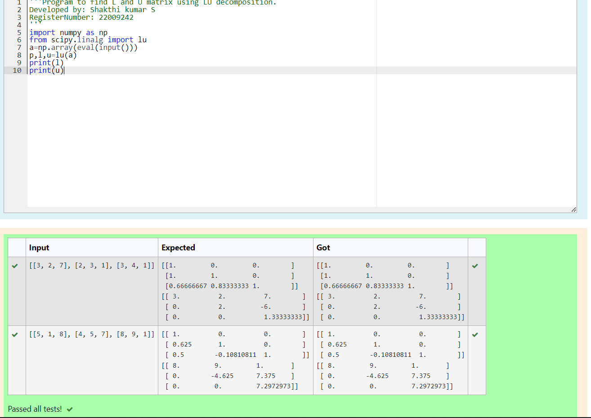

# LU Decomposition 

## AIM:
To write a program to find the LU Decomposition of a matrix.

## Equipments Required:
1. Hardware – PCs
2. Anaconda – Python 3.7 Installation / Moodle-Code Runner

## Algorithm
1. Get the input matrix for both of the programs
2. Import numpy as np
3. Find l and u matrix for the first program and find pivot for the second matrix
4. End the program

## Program:
(i) To find the L and U matrix
```python
/*
Program to find the L and U matrix.
Developed by: Shakthi kumar S
RegisterNumber: 22009242
*/
import numpy as np
from scipy.linalg import lu
a=np.array(eval(input()))
p,l,u=lu(a)
print(l)
print(u)
```
(ii) To find the LU Decomposition of a matrix
```python
/*
Program to find the LU Decomposition of a matrix.
Developed by: Shakthi kumar S
RegisterNumber: 22009242
*/
import numpy as np
from scipy.linalg import lu_factor,lu_solve
a=np.array(eval(input()))
b=np.array(eval(input()))
lu,piv=lu_factor(a)
x=lu_solve((lu,piv),b)
print(x)
```

## Output:




## Result:
Thus the program to find the LU Decomposition of a matrix is written and verified using python programming.

